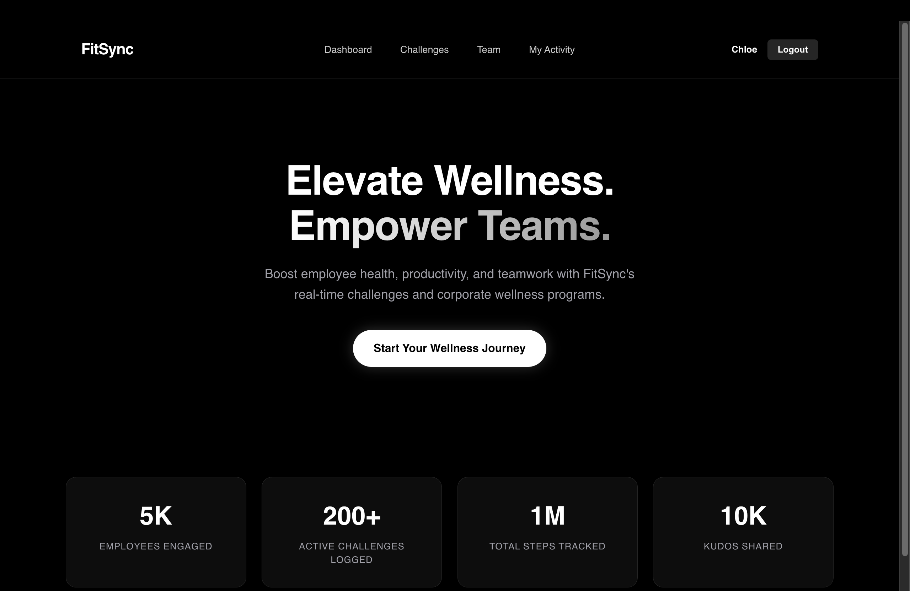
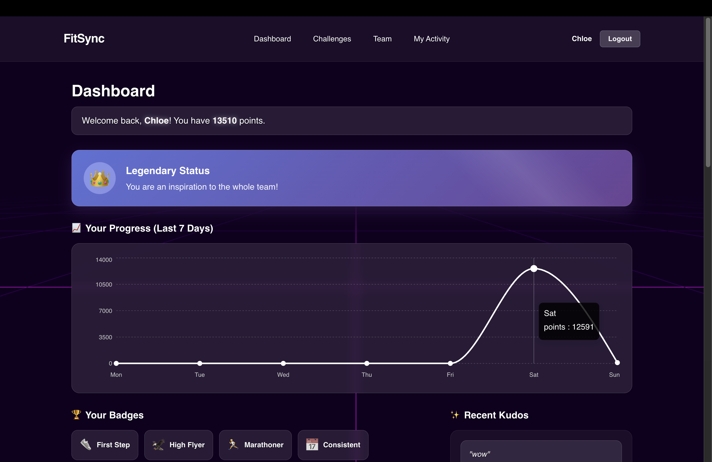
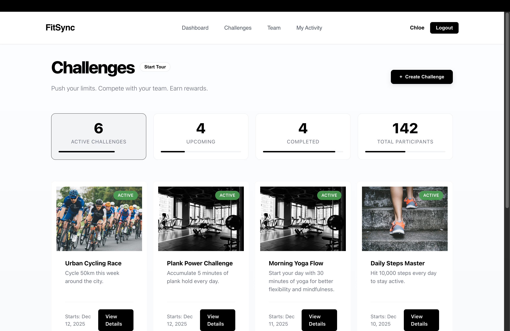
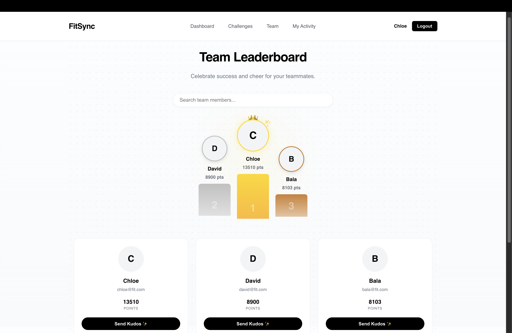
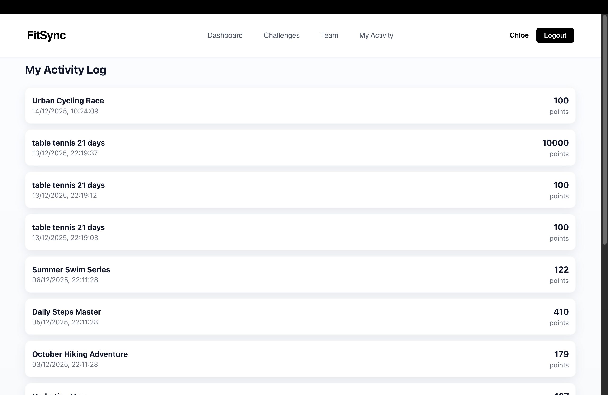

# 🏃‍♂️ FitSync - Gamified Employee Wellness Platform

FitSync is a modern, interactive fitness tracking application designed to boost team engagement and wellness through gamification. It combines activity tracking with social features like challenges, leaderboards, and real-time kudos to create a fun, competitive environment.



## 🚀 Live Demo

| Frontend (Vercel) | Backend (Render) |
|-------------------|------------------|
| [**View Live Demo**](INSERT_DEPLOY_LINK_HERE) | [API Status](INSERT_API_LINK_HERE) |

---

## 📸 Screenshots

| **Interactive Dashboard** | **Challenges Arena** |
|:-------------------------:|:--------------------:|
|  |  |
| *3D Retro Grid Background & Glassmorphism UI* | *Filter, Join & Create Competitions* |

| **Leaderboard** | **Activity Logging** |
|:---------------:|:--------------------:|
|  |  |
| *Real-time rankings & Team View* | *Track progress with interactive charts* |

---

## ✨ Key Features

*   **🎮 Gamified Experience**: Earn points, unlock badges (e.g., "Early Bird", "Weekend Warrior"), and climb the ranks.
*   **🏆 Challenges System**: Users can create custom challenges or join existing ones (Active, Upcoming, Completed).
*   **📊 Interactive Dashboard**: Features a stunning **3D Retro Grid background** (Three.js), glassmorphism cards, and dynamic progress charts (Recharts).
*   **💬 Social & Real-time**: Send "Kudos" to teammates instantly using Socket.io.
*   **📈 Analytics**: Visual breakdown of weekly activity and points history.
*   **🔐 Secure Auth**: JWT-based authentication with protected routes.
*   **📱 Responsive Design**: Fully optimized for desktop and mobile devices.

---

## 🛠️ Tech Stack

### **Frontend**
*   **React (Vite)**: Fast, modern UI development.
*   **Three.js**: Immersive 3D background effects.
*   **Recharts**: Data visualization for activity stats.
*   **Socket.io-client**: Real-time updates for kudos and notifications.
*   **CSS Modules**: Custom styling with Glassmorphism effects.

### **Backend**
*   **Node.js & Express**: Robust REST API architecture.
*   **MongoDB Atlas**: Cloud database for scalable data storage.
*   **Socket.io**: Real-time bidirectional event communication.
*   **JWT (JSON Web Tokens)**: Secure user authentication.

---

## 🚀 Getting Started

Follow these steps to run the project locally.

### Prerequisites
*   Node.js (v14+)
*   MongoDB Atlas Account (or local MongoDB)
*   Git

### 1. Clone the Repository
```bash
git clone https://github.com/YOUR_USERNAME/fitsync.git
cd fitsync
```

### 2. Backend Setup
Navigate to the server folder and install dependencies:
```bash
cd server
npm install
```

Create a `.env` file in the `server` directory:
```env
PORT=5001
MONGO_URI=your_mongodb_connection_string
JWT_SECRET=your_super_secret_key
```

Start the server:
```bash
npm run dev
```

### 3. Frontend Setup
Open a new terminal, navigate to the client folder, and install dependencies:
```bash
cd client
npm install
```

Create a `.env.local` file in the `client` directory:
```env
VITE_API_URL=http://localhost:5001/api
VITE_WS_URL=http://localhost:5001
```

Start the React app:
```bash
npm run dev
```

---

## 📂 Project Structure

```
fitsync/
├── client/                 # React Frontend
│   ├── src/
│   │   ├── components/     # Reusable UI components (3D Grid, Header, Cards)
│   │   ├── pages/          # Main views (Dashboard, Challenges, Login)
│   │   ├── api/            # Axios configuration
│   │   └── sockets/        # Socket.io connection logic
│   └── ...
├── server/                 # Node.js Backend
│   ├── src/
│   │   ├── controllers/    # Logic for Auth, Challenges, Activities
│   │   ├── models/         # Mongoose Schemas
│   │   ├── routes/         # API Routes
│   │   └── utils/          # Seeding scripts
│   └── ...
└── README.md
```

---

## 🤝 Contributing

Contributions are welcome! Please fork the repository and submit a pull request.

1.  Fork the Project
2.  Create your Feature Branch (`git checkout -b feature/AmazingFeature`)
3.  Commit your Changes (`git commit -m 'Add some AmazingFeature'`)
4.  Push to the Branch (`git push origin feature/AmazingFeature`)
5.  Open a Pull Request

---

## 📄 License

Distributed under the MIT License. See `LICENSE` for more information.

---

Made with ❤️ by **[Your Name]**
